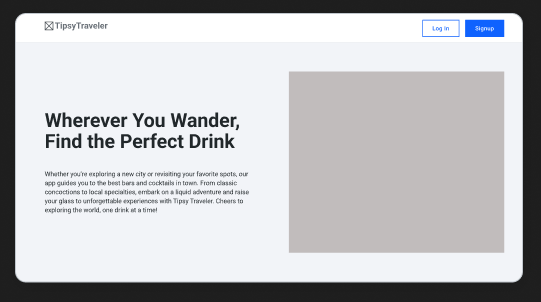

# Tipsy_Traveler

The Tipsy Traveler is an app that allows users create profiles and explore various locations and discover the best bars and drinks in each area. It provides essential information such as city/town walkability, crime rate, population, and age requirements for drinking. Users can actively contribute by editing, adding, or deleting locations to ensure up-to-date and accurate information. With The Tipsy Traveler, users can make informed decisions and enhance their nightlife experiences in new cities or their own hometown and share with friends.

* Technologies used: Ruby on Rails, MongoDB, React, JWTAuth, HTML/CSS, 
* Link to Github
* Link to Deployed Website
* Link to Trello

## UI:

